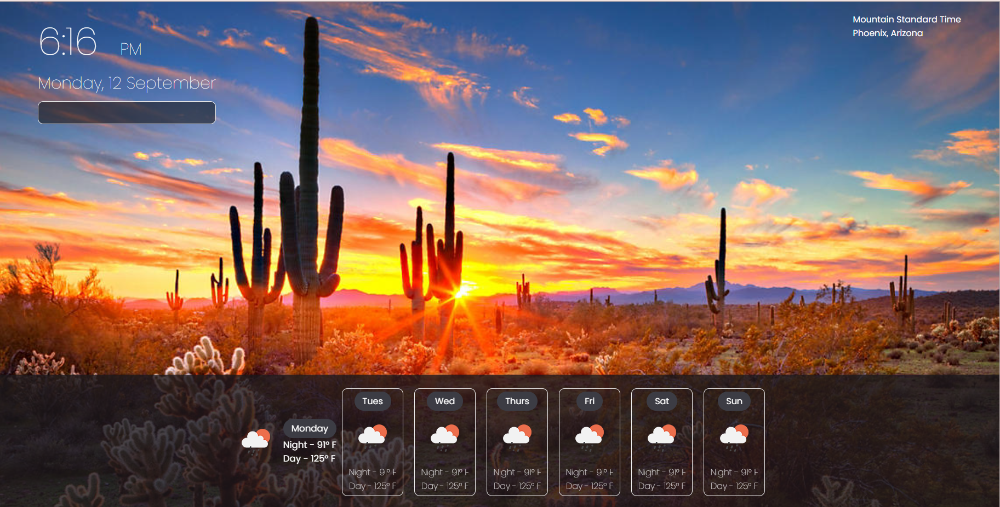

# theWeatherGworl

## Description

Provide a short description explaining the what, why, and how of your project. Use the following questions as a guide:

My motivation to build app is because the info on my cell phone just was not enough. I build this project because i needed more, MORRREE!
The problem this solves is i can know know what i feel like outside without having to step outside! I learned how to apply API to my code. 

## Usage

From this webpae you can access time current time in arizona as well as view the tempuature at sunset and sunrise. As well as get predicted temps for future days. 

